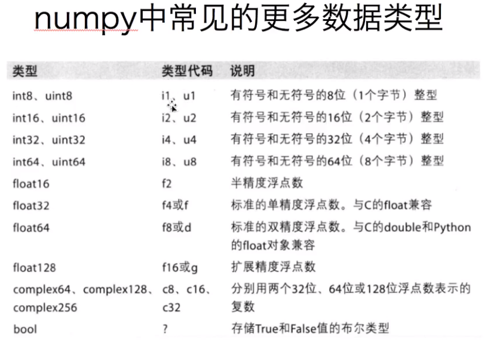

# [numpy中文文档](https://www.numpy.org.cn/index.html) <br>

### 什么是numpy <br>
NumPy是一个功能强大的Python库，主要用于对多维数组执行计算。NumPy这个词来源于两个单词`Numerical`和`Python`。NumPy提供了大量的库函数和操作，可以帮助程序员轻松地进行数值计算。这类数值计算广泛用于以下任务： <br>
  - 机器学习模型：在编写机器学习算法时，需要对矩阵进行各种数值计算。例如矩阵乘法、换位、加法等。NumPy提供了一个非常好的库，用于简单(在编写代码方面)和快速(在速度方面)计算。NumPy数组用于存储训练数据和机器学习模型的参数。<br>
  - 图像处理和计算机图形学：计算机中的图像表示为多维数字数组。NumPy成为同样情况下最自然的选择。实际上，NumPy提供了一些优秀的库函数来快速处理图像。例如，镜像图像、按特定角度旋转图像等。 <br>
  - 数学任务：NumPy对于执行各种数学任务非常有用，如数值积分、微分、内插、外推等。因此，当涉及到数学任务时，它形成了一种基于Python的MATLAB的快速替代。 <br>

### 一维矩阵的创建和数据类型 <br>
```python
import numpy as np
import random

t1 = np.array([1,2,3])
print(type(t1)) # <class 'numpy.ndarray'

t1 = np.array(range(0,10,2))
t2 = np.arange(0,10,2)
print(t1,t2) # 这两种写法一样的
print(t2.dtype) # int32 类型不同占用空间不同

t4 = np.arange(1,10,dtype=float) # 这样有时候会降低资源占用
print(t4,t4.dtype)

t5 = np.array([2,9,0,1,0,0],dtype=bool)
print(t5,t5.dtype)

# .astype() 数据类型转换
t6 = t5.astype('int8') # 显然这种转换有风险 会损失或者改变原有的数据
print(t6,t6.dtype) # [1 1 0 1 0 0] int8

t7 = np.array([random.random() for i in range(10)])
print(t7,t7.dtype)

t8 = t7.round(2) # t8 = np.round(t7,2) 规范小数位数 python自带.round()函数
print(t8,t8.dtype)
``` 
 <br>
### 矩阵的形状和简单计算 <br>
```python
import numpy as np

'''1 .shape 查看矩阵形状'''
t1 = np.arange(2)
# print(t1,t1.shape)
# (10,)不代表10行1列 一维数组这里省略表示1行10列 (10,1)才代表10行1列
# 不能将(10,)与(10,1)等同😄

t2 = np.array([[0,1,2],[3,4,5]])
# print(t2,t2.shape) # (2, 3)代表2行3列
# 可以看到 shape函数给出的元组里面有几个数 这个矩阵就是几维矩阵

'''2 .reshape() 矩阵转型'''
t3 = np.arange(24)
t4 = t3.reshape((4,6)) # 3*4=12
# print(t4,t4.shape)
t5 = t3.reshape((2,3,4)) # 2*3*4=24 2层3行4列
# print(t5,t5.shape)
t6 = t5.reshape((4,6))
# t6 = t4.reshape((t4.shape[0]*t4.shape[1],)) # 直接降为1维矩阵
t5 = t5.flatten() # .flatten() 直接降为1维

'''3 矩阵的简单计算 矩阵与实数，同型矩阵加减乘除属于基本知识
但是numpy中矩阵维度不全一样也可以进行数学上不能进行的运算'''
# t7 = t2/0
# print(t7) # nan表示这不是一个数 inf表示infinity 无穷大😂
t8 = t1.reshape(2,1)
t9 = t1 + t8
print(t1,t1.shape) # 两个不同型的矩阵的减法 当某一维一样时还是可以算一下的😂
print(t8,t8.shape)
print(t9,t9.shape)
```
### numpy的广播原则😀 <br>

  - 规则1：如果两个数组的维度不相同，那么小维度数组的形状将会在最左边补1
  - 规则2：如果两个数组的形状在任何一个维度上都不匹配，那么数组的形状会沿着维度为1扩展以匹配另外一个数组的形状。
  - 规则3：如果两个数组的形状在任何一个维度上都不匹配并且没有任何一个维度为1,那么会引起异常。<br>
还有一种表述是：如果两个矩阵的后缘维度(trailing dimension，从末尾开始算起的维度)的轴长度相符或者其中一方的长度为1，则认为这两个矩阵是广播兼容的。广播会在缺失和(或)长度为1的维度上进行。<br>
😀举个栗子：<br>
(2,3,4)矩阵可以和(3,4)矩阵进行计算，这两个矩阵的维度不等，但是(3,4)等价于(1,3,4)这两个矩阵的维度就相等了，高阶维度的轴长度不等，根据原则2，将沿维度为1扩展(1,3,4)为(2,3,4)，显然这个时候两个矩阵的形状都是(2,3,4)。<br>
同理(4,2,5,4)和(2,1,4)也可以计算，(2,1,4)可以扩展为(2,5,4)，再进一步扩展为(1,2,5,4)，再进一步扩展为(4,2,5,4)，这样两个矩阵的形状就一样了。<br>	
同理(2,3,4)和(2,4)就不能进行计算。<br>
那么扩展的方式是怎样呢？显然会想当然的认为不全的地方补0即可，但是在numpy中并不是这样，在numpy中沿轴长度为1的维度扩展会复制自己原来轴长度为1的数据直到轴长相等。😀 <br>
```
[2 3] + [2 = [4 5
             3]   4 6]
```

### 轴(Axis) <br>
对于一维矩阵 行axis=0 <br>
对于二维矩阵 行axis=0 列axis=1 <br>
对于三位矩阵 层axis=0 行axis=1 列axis=2 (这里的层是我瞎掰的😥)<br>
……
##### numpy读取数据 <br>
对于numpy来说，显然读取数据并不是专长，这些工作将由后面会介绍的pandas模块来实现，这里仅简单介绍小型规范的CSV(comma separated value 逗号分隔值文件)文件的读取。 <br>
numpy.load(fname, dtype=float, comments='#', delimiter=None, converters=None, skiprows=0, usecols=None, unpack=False, ndmin=0, encoding='bytes', max_rows=None) <br>
frame 文件，字符串或产生器，可以是.gz或者bz2压缩文件 <br>
dtype 数据类型 默认np.float <br>
delimiter 分隔字符串 默认空格 <br>
skiprows 跳过前.行 一般需要调过第一行表头 <br>
usecols 读取指定的列 索引 元组类型 <br>
unpack 默认false 如果True 数据会被转置 跟.transpose() 转置函数一样的效果<br>
### numpy取值和切片 <br>
```python
import numpy as np

a = np.arange(16).reshape(4,4)
# a = [[0, 1, 2, 3],
#      [4, 5, 6, 7],
#      [8, 9, 10, 11],
#      [12, 13, 14, 15]]
# 切片操作一直在报错，找了半天的bug 然后突然发现，这个 a 看起来很像矩阵 其实不是矩阵😂

# 矩阵的切片与列表取值很像 以 , 区分维度  : 进行多行选取  [] 组合指令
# 取行
# t1 = a[0]
# t1 = a[1:]
# t1 = a[[0,1,3]] # 嗨呀 小错误导致半天找不到原因=。=
# t1 = a[2:,2:]
# t1 = a[1:3,1:3] # 正常
# t1 = a[[1,3],[1,3]] # 异常 注意这里的计算 [a,b] 这种取值是列表式取值，对于(4,4)的矩阵，[1,3] 取大列表的索引为1和3的列表 返回(2,4)矩阵 再次取[1,3]，取第一个列表的索引为1和第二个列表索引为3的值 返回(1,2)矩阵 这个矩阵实际上取的是(1,1) (3,3) 这两个位置的值
# t1 = a[[1,3],1:3] # 正常
# t1 = a[1:3,[1,3]] # 正常
# t1 = a[[0,2:3],] # 语法错误 不能在[]内取: 但是可以用上面两个方法代替 毕竟1:3就等价于[1,2]😀
# print(t1)
```
### numpy中数值的修改 <br>
```python
import numpy as np

a = np.arange(25).reshape((5,5))
b = np.arange(25).reshape((5,5))
c = np.arange(25).reshape((5,5))
# print(a < 10) # 注意这种 bool索引 语法
# a[a < 10] = 10
# print(a) # []中的语法是修改矩阵索引和切片的部分 要修改就只需要索引到需要的之后再外面加上 a[] 然后用 = 赋值即可
# a[0:1] = 1
# print(a) # 这部分的内容就是用了个赋值运算符 不细说了


'''np.where() numpy中的三元运算符'''
a = np.where(a < 10,10,1)
# 表示将矩阵a中所有值小于10的部分替换为10，不满足这个条件的改为1 这三个参数缺一不可 用法比较单一 测试了下只能简化很简单的bool索引 而且就简化了一部 稍微复杂一点的就不能实现 有什么意义😥

'''.clip() 裁剪工具'''
b = b.clip(10,20)
c = c.clip(20,10)
print(b)
print(c)
# 用法感觉更加单一 将矩阵中所有小于10的替换为10 大于20的替换为20 当然这些运算可能在numpy中会有较多的应用。
# 值得注意的是这两个参数的位置是固定的，交换位置会得到不一样的结果，小于20的替换为20 大于10的替换为10 但是这种语法有点问题 这个运算是从 = 右边开始 从左往右进行 先执行小于20的替换为20的部分 再去执行大于10的替换为10 不会发生逻辑错误😥
```
### numpy中的nan和inf <br>
#### nan: not a number(float类型) <br>
当0/0时；无穷大减无穷大时；读取本地文件为float，如果有缺失时 <br>
  1. 两个nan不相等`np.nan == np.nan  False`，`np.nan != np.nan  True`
  2. 利用nan这一特性可以判断矩阵中nan的个数`np.count_nonzero(a!=a)`这是个双重否定句 `a!=a`返回布尔类型，也可以理解为 0 1 矩阵，然后用np.count_nonzero()计数函数计算非零数值的个数<br>这里的`a!=a`语句 可以用`np.isnan(a)`来替换，这是numpy中集成的函数，也即`np.count_nonzero(np.isnan(a))`两个语句一样的效果 <br>
  3. nan与任何数值计算结果都是nan，这样处理数据有时候会不方便，需要对nan进行替换，一般将nan替换为均值(中值)或者直接删除有nan的一行😥 <br> 

```python
import numpy as np

t1 = np.arange(12).reshape((3, 4)).astype('float')
t1[0, 1:] = np.nan  # 赋值修改 一般是对列做修改
print(t1)  # .shape返回的是一个元组 这里的[0]即代表第0个维度轴长度 也就是行的长度
def fill_nan(arry):
    for i in range(arry.shape[1]):
        tem_col = arry[:, i]  # 取出当前列
        nan_num = np.count_nonzero(tem_col != tem_col)
        if nan_num != 0:  # 说明当前列有nan
            tem_col_not_nan = tem_col[tem_col == tem_col]
            # print(tem_col_nan)
            tem_col[tem_col != tem_col] = tem_col_not_nan.mean()
            # 至此 对矩阵中nan数值的替换就完成了 定义为函数 方便后调用
    return arry

t1 = fill_nan(t1)
print(t1)
```

#### numpy中常用的统计函数 <br>
  1. 求和： a.sum(axis=None) <br>
  2. 均值： a.mean(axis=None) <br>
  3. 中值： np.median(a,axis=None) <br>
  4. 最大值： a.max(axis=None) <br>
  5. 最小值： a.min(axis=None) <br>
  6. 极差： np.ptp(a,axis=None) <br>
  7. 标准差： a.std(axis=None) <br>

#### inf: 正无穷 (-inf表示负无穷) <br>
当分母为0分子不为0时 出现无穷大 <br>
### 矩阵的拼接 <br>
np.vstack((a,b,c))  垂直拼接(vertically) <br>
np.hstack((a,b,c))  水平拼接(horizontally) <br>
#### 矩阵的行列交换 <br>
利用矩阵赋值语句即可： <br>
交换行`t[[a,b],:] = t[[b,a],:]` <br>
交换列`t[:,[a,b]] = t[[:,b,a]]` <br>
### numpy生成随机数😀 <br>
  1. np.random.rand(d0,d1,...dn)  创建d0-dn维度的均匀分布的随机数矩阵，float类型，范围(0,1) <br>
  2. np.random.randn(d0,d1,...dn)  创建d0-dn维度的标准正态分布的随机数矩阵，float类型，平均数0，标准差1 <br>
  3. .randint(min,max,(shape))  从给定的范围内选取整形随机数，范围[min,max)形状是shape <br>
  4. np.random.uniform(min,max,(size))  产生具有均匀分布的矩阵，形状是size <br>
  5. np.random.normal(loc,scale,(size))  从指定的正态分布中随机抽取样本，分布中心是loc(概率分布的均值)，标准差是scale，形状是size <br>
  6. np.random.seed(n)  随机数种子，n是给定的种子值，由于计算机生成的是伪随机数，所以可以通过设定相同的随机数种子来得到相同的随机数 <br>

#### numpy常见的其他方法 <br>
  1. 获取最大值最小值的位置：    
    - np.argmax(a,axis=None)
    - np.argmin(a,axis=None)
  2. 创建一个全0矩阵： np.zeros((a,b))
  3. 创建一个全1矩阵： np.ones((a,b))
  4. 创建一个对角线为1的矩阵： np.eye(a)