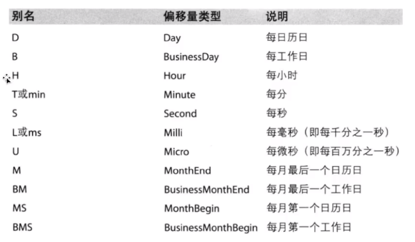

# [Kaggle: Your Home for Data Science](https://www.kaggle.com/)
# [pandas中文文档](https://www.pypandas.cn/docs/) <br>

### 什么是pandas <br>
Pandas是一个强大的分析结构化数据的工具集；它的使用基础是Numpy（提供高性能的矩阵运算）；用于数据挖掘和数据分析，同时也提供数据清洗功能。 <br>
  - DataFrame: DataFrame是Pandas中的一个表格型的数据结构，包含有一组有序的列，每列可以是不同的值类型(数值、字符串、布尔型等)，DataFrame既有行索引也有列索引，可以被看做是由Series组成的字典。 <br>
  - Series: 是一种类似于一维数组的对象，是由一组数据(各种NumPy数据类型)以及一组与之相关的数据标签(即索引)组成。仅由一组数据也可产生简单的Series对象。 <br>

### Series的创建 <br>
```python
import pandas as pd

a = pd.Series([18,22,30]) # 最简单的创建，默认索引
print(a,type(a)) # dtype: int64 <class 'pandas.core.series.Series'>
# 这里的a与numpy中一样可以使用.astype() .detype方法

t1 = pd.Series([1,2,3,4],index=list('abcd'))
print(t1,type(t1))

dict = {
    'name':'kin',
    'age':18,
    'weight':60
}
t2 = pd.Series(dict)
print(t2,type(t2)) # dtype: object <class 'pandas.core.series.Series'>
```
Series对象本质上由两个数组构成，一个数组构成对象的键(index，索引)，一个数组构成对象的值(value) <br>
### Series切片与索引 <br>
```python
import pandas as pd
dict = {
    'name':'kin',
    'age':18,
    'weight':60
}
t1 = pd.Series(dict)
print(t1['name'], t1[0]) # 可以看到默认有一个创建顺序索引
print(t1[:2], t1[2:]) # 选中连续多个数据
print(t1[[0, 2]]) # 选中不连续的多个数据
# print(t2[t2>10]) # 也可以bool索引 这里就写个伪代码演示一下

print(t1.index,type(t1.index))
print(t1.values,type(t1.values))
```
### DataFrame的属性 <br>
```python
import pandas as pd

t1 = pd.read_csv('./demo2.csv')
t2 = pd.DataFrame(t1)
print(t2.index)
print(t2.columns)
print(t2.shape)
print(t2.dtypes)
print(t2.ndim)
print(t2.head())
print(t2.tail())
print(t2.info())
print(t2.describe())

'''.sort_values() 按值排序'''
t3 = t2.sort_values('ziwai',ascending=False)
print(t3)
```
行索引：横向索引，叫index，axis=0 <br>
列索引：纵向索引，叫column，axis=1 <br>
DataFrame的属性的基础属性： <br>
  - df.shape  行数列数 <br>
  - df.dtypes  列数据索引 <br>
  - df.ndim  数据维度 <br>
  - df.index  行索引 <br>
  - df.columns  列索引 <br>
  - de.values  对象值 二维矩阵 <br>

DataFrame整体情况查询：
  - df.head()  显示头部几行 默认5行 <br>
  - df.tail()  显示末尾几行 默认5行 <br>
  - df.info()  相关信息概述：行数 列数 列索引 列非空值个数 列类型 内存占用 <br>
  - df.describe()  快速综合统计结果：计数 均值 标准差 最小值 四分位数  最大值<br>

### DataFrame切片 <br>
```python
import pandas as pd
import numpy as np

t1 = pd.read_csv('./demo2.csv')
t2 = pd.DataFrame(t1)
print(t2[:7]) # 对行进行操作 切连续的行
print(t2['ziwai']) # 对列进行操作 切指定的列

####################################################
# pandas利用标签和位置索引数据
print(t2.loc[0,'ziwai'],type(t2.loc[0,'ziwai']))
print(t2.loc[[0,2],['ziwai','anqi']])
print(t2.loc[:1,]) # 😥😥😥 只有这里的.loc[]方法里面的 : 是闭合取值的 会取到1
print(t2.iloc[:1,])
print(t2.iloc[:,[5]]) # 按位置取
t2.iloc[0,0] = np.nan # dateframe会自动把数值转换为float 所以这里没有报错
```
### DataFrame的常用统计方法 <br>
```python
import pandas as pd
import numpy as np

t1 = pd.read_csv('./demo2.csv')
print(t1.head(26))

print(t1['chanlv'].mean()) # 获取某一列的平均值
print(len(set(t1['chanlv'].tolist()))) # 统计某一列去重后的元素个数
print(t1['chanlv'].unique()) # 获取某一列去重后的元素

# t2 = [i for j in t1 for i in j] # = 右边是从左往右执行 这个是常见的列表嵌套列表展开的办法 但是这里不能对矩阵用

t2 = np.array(t1).flatten() # 对矩阵进行操作 直接用numpy自带的扁平功能😥
t3 = len(set(t2))
print(t3) # 整个矩阵去重后的元素个数
```
### 字符串离散化案例 <br>
[电影种类的分类统计课程演示](https://www.bilibili.com/video/av49778784/?p=486) <br>
思路： <br>
`temp_genre_list = df['genre'].str.split(',').tolist()` -->将genre这一列的数据取出 字符串的方式 以“，”分割 然后转化为大列表嵌套小列表 <br>
`genre_list = []`  --> 定义一个空列表用来存放下面的表头 <br>
```
for i in temp_genre_list:
	genre_list.extend(i)  # 这里的i就是一个个分割后的电影种类名
genre_list = set(genre_list) # 列表去重
```
`zeros_genre = pd.DataFrame(np.zeros(shape=(de.shape[0],len(genre_list)),dtype=int),columns=genre_list)` --> 构造一个全零矩阵，并设置电影种类为表头 <br>
```
for i in range(de.shape[0]):
	genres = df['genres'][i] # 这里的i是遍历大列表后得到的小列表
	zeros_genre.loc[i,genres.split(',')] =1 # 这里用标签名来定位
```
`genre_count = zeros_genre.sum(axis=0)` --> 将统计列表按行sum统计 <br>
### 数据的行合并 join <br>
在学习爬虫的时候，曾经使用过 `"".join()`方法将散乱的字符串组合成一个字符串😀 <br>
`.join()` 默认将行索引相同的数据合并到一起 <br>
```伪代码
   0  1             X  Y            0  1  X  Y
A  1  2          A  7  8         A  1  2  7  8
B  3  4   join   B  9  0   ->    B  3  4  9  0
C  5  6                          C  5  6  NaN NaN
```
```python
import pandas as pd
import numpy as np

t1 = pd.DataFrame(np.ones((2,4)),columns=list('abcd'))
t2 = pd.DataFrame(np.zeros((3,3)),columns=list('xyz'))
# print(t1.join(t2))
print(t2.join(t1))
```
经测试发现列名如果重叠，会报错😄 <br>
`ValueError: columns overlap but no suffix specified: Index(['a', 'b', 'c'], dtype='object')` <br>
### 数据的合并 merge <br>
```python
import pandas as pd
import numpy as np

t1 = pd.DataFrame(np.ones((4,4)),columns=list('abcd'))
t2 = pd.DataFrame(np.zeros((3,3)),columns=list('xyz'))
t3 = pd.DataFrame(np.arange(9).reshape((3,3)),columns=list('afx'))
print(t1)
print(t2)
print(t3)
print(t1.merge(t3,on='a'))
t1.loc[2,'a'] = 6
t1.loc[0,'a'] = 9
t1.loc[3,'a'] = 0
t3.loc[1,'a'] = 1
t3.loc[0,'a'] = 0
print(t1)
print(t3)
print(t1.merge(t3,on='a'))
# 默认的merge方式是inner 交集 测试了几波发现了规律 这个默认的合并很诡异 当t1与t3的'a'标签中出现相同的元素 出现几次 就会将此行数据合并 将不相同的元素的行抛弃 这个判定很迷 逐个元素判定 而且感觉还有个重新排序的效果但是排序规则不明

# 当指定其他的方式时
print(t1.merge(t3, on='a',how='outer'))
# 指定outer时 并集 不相同的元素不会被抛弃 还是会连在一起 缺失的部分以NaN补齐
print(t1.merge(t3, on='a',how='left'))
# 指定left时会以左边的为准 不会抛弃左边的任何一行 缺失的部分以NaN补齐
print(t1.merge(t3, on='a',how='right'))
# 指定right时会以右边的为准 不会抛弃右边的任何一行 缺失的部分以NaN补齐

# 当标签没有相同的时候 可以用 left_on right_on 来分别指定标准 这个部分很杂 与数据库My SQL操作很像
```
### 数据的分组聚合 <br>
.groupby()函数demo <br>
```python
import pandas as pd
import numpy as np

t1 = pd.read_csv('./demo3.csv')

# 按大标签country来分组
# t1_country = t1.groupby(by='country') # 按照国家分组
# print(t1_country,type(t1_country)) # 分组后的数据可以遍历或者聚合
# for i in t1_country:
#     print(i) # (,) 返回元组类型
#
# print(t1_country['country'].count()) # 随便抽取一列没有缺失的数据
# t2 = t1_country['country'].count()
# print(t2['china']) # 单独抽取出一列后才能取行索引


# 统计country下面中国组里面各个province的信息
print(t1)
china_date = t1[t1["country"] == 'china'] # 判断用== 不要用赋值=
print(china_date)
grouped = china_date.groupby(by='province').count()['store number']
grouped = china_date.groupby(by='province').sum()['store number']
grouped = china_date.groupby(by='province').mean()['store number']
grouped = china_date.groupby(by='province').median()['store number']
grouped = china_date.groupby(by='province').std()['store number']
grouped = china_date.groupby(by='province').var()['store number']
grouped = china_date.groupby(by='province').min()['store number']
print(grouped)
print('@'*80)

# 也可以在分组的时候传入两个参数
grouped = t1.groupby(by=[t1['country'],t1['province']]).count()['store number'] # 这里一列数据有两个索引 复合索引
grouped = t1.groupby(by=[t1['country'],t1['province']]).count()[['store number']] # 语法是要取多个 但是传参数是只传入一个 这样返回值就是dateframe类型
print(grouped,type(grouped))
```
### 索引和符合索引 <br>
记住这里的索引是行索引
  - df.index  获取index <br>
  - df.index=['x','y'...]  指定index 个数要与行数对应 <br>
  - df.reindex([..])  以新的index来在行中寻找，有的就不变，没有的取NaN<br>
  - df.set_index('column', drop=False)  指定某一列作为索引 <br>
  - de.set_index('column').index.unique()  指定的列的元素可能有重复的，这里先找到指定的索引的索引，然后去重 <br>

```python
import pandas as pd
import numpy as np

t1 = pd.DataFrame(np.arange(12).reshape((3,4)),index=list('abc'))
# t1.index = ['x','y'] # 少一个会报错
t1.reindex(['i','d']) # 嗯=。=不知道为啥这个操作没有用 哦 这个操作没有赋值不会返回值
print(t1.reindex(['i','d']))
print(t1.set_index(0,drop=False)) # 这里的新的索引名叫0 drop默认为True 会删掉转为index的列
print(t1[0].unique())
################################################################
t2 = t1.set_index(0,drop=False)
print(t2.index.unique()) # 返回的是索引的去重值
# 这里的index不止unique去重这个方法 还有长度len 列表list等等 是个可编辑对象
################################################################
t3 = t1.set_index([3,1],drop=False) # 一次扔两组列作为索引
print(t3)
print(t3.index)
################################################################
t4 = t1.set_index([0,1,2])
print(t4) # 就算只剩下一列数据 这里还是dateframe属性
t5 = t4[3] # 从dateframe中取出一列 就算只有1列 取出后就会变成series 而且保留原有的多个标签组 但是列名就会丢失 就一列要什么列名
print(t5)
# 这里的series对应3个标签组 对于实际情况而言 索引与索引之间是分层的 大的索引可能对应很多个元素 就像之前的中国索引下面还可以分为省份索引 当大索引在左边时可以方便的直接使用大索引获取多个值
# .swaplevel() 交换索引层级的函数
print(t5.swaplevel(0,1)) # 输入索引名的参数即可将两个索引调换位置
#################################################################
# 对于dateframe 直接使用t4[".."]时默认使用列索引 要使用行索引就需要用.loc()函数
print(t4)
print(t4.loc[0].loc[1].loc[2])
print(t4.loc[0,1,2]) # 这样可以简化语法
```
有关DateFrame和Series的索引知识点很重要，是查询筛选数据的基础😀ο(=•ω＜=)ρ⌒☆ <br>
```
t1 = pd.read_csv('./demo3.csv')
# 找出店铺总数排名前2的国家
t2 = t1.groupby(by='country').count()['store number'].sort_values(ascending=False)[:2] # 取前面两行数据
```
这段代码看得懂吗？ <br>
### 优化代码 <br>
```python
import pandas as pd
import numpy as np
t0 = pd.read_csv('./books.csv')
t1 = t0.iloc[:,:16] # 去掉那个很sb的最后一列

# 获取每一年出版额好书数量
t2 = t1[t1['original_publication_year'] != np.nan] # 去掉original_publication_year标签中缺失的部分
t3= t2.groupby(by='original_publication_year').count()['title']
# print(t3) # 至此就获得了每一年出版的数的分布

# 获取不同年份书的平均评分
t4 = t2['average_rating'].groupby(by=t2['original_publication_year']).mean()
# print(t4)

#######################################################
a0 = pd.read_csv('./911.csv')
# print(a0['title'])
print(a0.info()) # 我他妈真是日了狗了=。=这里的info要加()
a1 = a0['title'].str.split(':').tolist()
# a2 = []
# for i in a1:
#     a2.append(i[0])
a2 = list(set([i[0] for i in a1])) # 装逼流写法
print(a2) # 就三个分类 字符串分离后就可以构建全零矩阵来统计了

#######################################################
zeros = pd.DataFrame(np.zeros(shape=(a0.shape[0],len(a2))),columns=a2)
# 这里的行有43万之多 如果遍历行 会非常的慢 因此应该考虑遍历列 相比之下列只有3个
for i in a2: # 相当于优化算法
    zeros[i][a0['title'].str.contains(i)] = 1
    # 布尔索引
print(zeros)
# for i in range(a0.shape[0]): # 这个老算法太慢了 可见优化算法的重要性
#     zeros.loc[i,a1[i][0]] = 1
# print(zeros)
print(zeros.sum(axis=0)) # 至此不同类型的紧急情况的次数就统计出来了(ง •_•)ง

########################################################
b0 = pd.read_csv('./911.csv')
b1 = b0['title'].str.split(':').tolist()
b2 = [[i[0] for i in b1]]
# print(b2) # 正确 开始创建一个列 然后将列并入原有的dateframe
b3 = pd.DataFrame(np.array(b2).transpose())
print(b3) # 发现直接赋值得到的是一个行 需要resape 或者调用矩阵的转置函数
b0['type'] = b3 # 将列添加进去
print(b0.groupby(by='type').count()['title'])
# 达到了同样的效果！可将这种思路很不错！可以作为一个固定的增加新的列，然后使用groupby来调用count等方法
# 这里做的事其实不多 就是将列表中的不同元素做了count统计 方法是利用dateframe框架里面集成的函数

# 下面还可以对时间戳标签下的列进行类似的操作 可以提取其中的月份信息 然后和上面一样 剥离 打组 合并 分组 调用count函数
# 但是pandas里面有专门对时间序列的解决方案 这样会更加的方便
```
### pandas的时间序列 <br>

#### pandas重采样 <br>
.resample()  重采样指的是将时间序列从一个频率转化为另一个频率进行处理的过程，将高频数据转化为低频数据为降采样(显然降采样用的更多)，低频转高频为升采样 <br>
```python
import pandas as pd
import numpy as np

'''.date_range() 创建一段时间范围'''
'''.date_range(start=None,end=None,periods=None,freq='D')'''
t1 = pd.date_range(start='20171230',end='20180501',freq='10D')
print(t1)
t2 = pd.date_range(start='20171230',periods=10,freq='M')
print(t2)

'''.to_datetime('',format='')'''
a = pd.read_csv('./911.csv')
# 下面开始降采样
a['timeStamp'] = pd.to_datetime(a['timeStamp']) # 将字符串转化为pandas的时间序列
# 上面这个赋值只是增加了一个列 虽然列名是一样的 但是不会覆盖 还要调用索引的函数
# a.set_index('timeStamp',inplace=True) # 原地替换 就是覆盖
# 这里理解错误了 inplace的意思是修改dateframe 但是不创建新的对象 可以理解为没有这一项就需要定义一个新的对象去接受这个a
print('$'*80)
print(a.head(2))
# count_by_month = a.resample('M').count()['title'] # pandas真好用( •̀ ω •́ )✧
# print(count_by_month) # 这样就很方便的按月来统计了

#########################################################################
# 进一步增加要求，现在要对统计月 统计种类 思路仍然是增加一个列
a1 = a['title'].str.split(':').tolist() # 大列表套小列表
a2 = [i[0] for i in a1] # 遍历取值
a['type'] = pd.DataFrame(np.array(a2).transpose()) # 转置 然后复制添加列 不能先修改索引 不然这里的索引没有设置就是默认的0 1 2...
a.set_index('timeStamp',inplace=True)
count_by_month = a.resample('M').count()['title'] # pandas真好用( •̀ ω •́ )✧
print(count_by_month)
print(a.head(2))

# for gp_type in a.groupby(by='type'): # 这里的type只有三个去重元素 显然是外索引 为了优化算法 这里就先遍历外索引
#     count_by_month = gp_type.resample('M').count()['title']
# # 这里有些问题还不太明白
```
pandas的时间序列还有比较常见的函数`padas.PeriodIndex()`用来将分割的时间戳组合成时间段 <br>
`timeStamp = pandas.PeriodIndex(year=a['year'],month=a['month'],day=['day'],hour=a['hour'],freq='H')` <br>
还有一个函数，丢掉缺失的值`.dropna()`可以用来丢掉有缺省数据的行，当然列也可以但是很少用列，不会减少数据