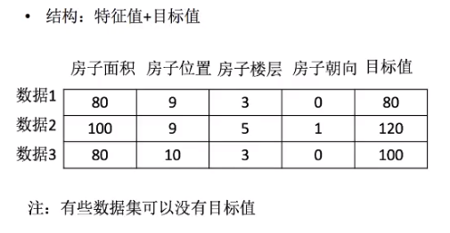

### 什么是机器学习  
机器学习是从**数据**中自动分析获得**规律(模型)**，并利用规律对**未知数据进行预测**  
机器学习(Machine Learning, ML)是一门多领域交叉学科，涉及概率论、统计学、逼近论、凸分析、算法复杂度理论等多门学科。专门研究计算机怎样模拟或实现人类的学习行为，以获取新的知识或技能，重新组织已有的知识结构使之不断改善自身的性能。  
它是人工智能的核心，是使计算机具有智能的根本途径，其应用遍及人工智能的各个领域，它主要使用归纳、综合而不是演绎。  
简言之，人工智能-->机器学习-->深度学习，这是一个发展和包含的过程。因此不要着眼于范围最大的人工智能，这个太大太空泛，而是着眼于机器学习，深度学习这些子领域。  

### 机器学习的应用  
  - 自然语言处理
  - 图像识别
  - 传统预测
  - 数据挖掘
  - 计算机视觉
  - 生物特征识别
  - 搜索引擎
  - 医学诊断
  - 检测信用卡欺诈
  - 证券市场分析
  - DNA序列测序
  - 语音和手写识别
  - 战略游戏和机器人运用 ...

### 数据集的构成  
值得一提的是，机器学习的数据大部分并不会储存在数据库中，例如MySQL，mangoDB等，这些数据库会受到性能瓶颈的限制，读取速度比较慢；另外这些数据库大都使用json格式，不太符合机器学习要求的格式。  
一般储存在诸如csv文件等，这些文件大小非常大，在G级别。  
常用的读取工具是pandas，pandas的速度是很快的，而pandas又是基于numpy的，numpy是非常快的。numpy为什么这么快呢？它可以释放全局解释器锁(GIL)👍  
### 可用数据集  
[kaggle](https://www.kaggle.com/datasets)  
  - 大数据竞赛平台
  - 80万科学家
  - 真实数据
  - 数据量巨大 😀

[UCI加州大学欧文机器学习库](http://archive.ics.uci.edu/ml/index.php)  
  - 收录了360个数据集
  - 覆盖科学，生活，经济各个领域
  - 数据量几十万

[scikit-learn](https://scikit-learn.org/stable/datasets/index.html#datasets)  
  - 数据量较小
  - 方便学习

### 常用数据集的数据结构组成  
结构： 特征值 + 目标值  
  

#### 数据中对特征处理  
pandas: 一个数据读取非常方便以及基本的处理格式的工具  
sklearn: 对特征的处理提供强大的接口(机器能识别处理的必须是数字形式，需要对pandas处理后的数据再进行进一步转换)   
上面的这些包含在一起就是特征工程。  

### 特征工程(特征的处理尤为重要，即使算法相同，特征处理上也会有差距)  
简单的说，特征工程是能够将数据像艺术一样展现的技术。为什么这么说呢？因为好的特征工程很好的混合了专业领域知识、直觉和基本的数学能力。但是最有效的数据呈现其实并不涉及任何的数据运算。  
本质上来说，呈现给算法的数据应该能拥有基本数据的相关结构或属性。当你做特征工程时，其实是将数据属性转换为数据特征的过程，属性代表了数据的所有维度，在数据建模时，如果对原始数据的所有属性进行学习，并不能很好的找到数据的潜在趋势，而通过特征工程对你的数据进行预处理的话，你的算法模型能够减少受到噪声的干扰，这样能够更好的找出趋势。事实上，好的特征甚至能够帮你实现使用简单的模型达到很好的效果。  