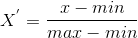
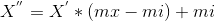
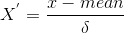
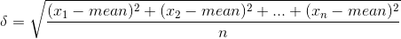

[markdown插入数学公式 $$ $$$$](http://latex.codecogs.com/eqneditor/editor.php)

### 什么是特征预处理 <br>
特征与处理就是通过特定的统计方法(数学方法)将数据(数字)转换为算法要求的数据 <br>
这里我们将行称作样本，列称作特征 <br>

### 特征预处理方法 <br>
  - 数值型数据：
    - 标准缩放
      - 归一化
      - **标准化**
      - 缺失值
  - 类别型数据
      - One-hot编码
  - 时间型数据
      - 时间的切分

sklearn库的特征处理API <br>
sklearn.preprocessing <br>

#### 归一化 <br>
  - 功能： 通过对原始数据进行变换把数据映射到默认为[0,1]之间
  - 目的： 统计者认为各个特征同等重要，为了使某一特征队最终结果不会造成更大的影响，需要使用归一化处理
  - 特点： 在特定场景下，最大值最小值是变化的，另外，最大值最小值非常容易受到异常点的影响，所以这种方法鲁棒性较差，只适合传统精确小数据场，但是这种场景非常罕见，也就是说我们基本上不会用这个公式一看就很SB的方法 <br>

公式： <br>
 <br>
 <br>
作用于每一列，max为一列的最大值，min为列的最小值。ms，mi分别为指定区间值，默认mx为1，mi为0 <br>

归一化API： <br>
sklearn.preprocessing.MinMaxScaler <br>
语法： <br>
  - MinMaxScalar(feature_range=(0,1)...) <br>
    - 每个特征缩放到给定范围(默认[0,1])
      - MinMaxScalar.fit_transform(x)
	    - x: numpy array格式的数据[n_samples,n_features]
	    - 返回值：转换后形状相同的array

```python
from sklearn.preprocessing import MinMaxScaler
mm = MinMaxScaler(feature_range=(5,10))
data = mm.fit_transform([[90,2,10,40],[60,4,15,45],[75,3,13,46]])
print(data)

# 返回
[[10.          5.          5.          5.        ]
 [ 5.         10.         10.          9.16666667]
 [ 7.5         7.5         8.         10.        ]]
```

### 标准化(标准正态分布大法好😀) <br>
  - 功能： 通过对原始数据进行变换，把数据变换到均值为0，标准差和方差为1的范围内
  - 目的： 统计者认为各个特征同等重要，为了使某一特征队最终结果不会造成更大的影响，需要使用标准化处理
  - 特点： 少量异常点对平均值影响不大(大量数据的条件下)，标准差波动也会较小，这样整体差别就不会太大(都要从公式的角度来看这个问题)

公式： <br>
 <br>
 <br>
这里就是典型的标准正态分布转换公式，mean为平均值，δ为标准差。 <br>

标准化API： <br>
sklearn.preprocessing.StandarScaler <br>
语法： <br>
  - StandarScaler(...) <br>
    - 处理后每列数据就是一个标准正态分布 <br>
      - StandarScaler.fit_transform(x) <br>
        - x: numpy array格式的数据[n_samples,n_features] <br>
	    - 返回值：转换后形状相同的array <br>
	  - StandarScaler.mean_ <br>
	    - 原始数据中每列特征值的平均值 <br>
	  - StandarScaler.std_ <br>
	    - 原始数据每列特征的方差 <br>

```python
from sklearn.preprocessing import StandardScaler
std = StandardScaler()
data = std.fit_transform([[1,-1,3],[2,4,2],[4,6,-1]])
print(data)

# 返回
[[-1.06904497 -1.35873244  0.98058068]
 [-0.26726124  0.33968311  0.39223227]
 [ 1.33630621  1.01904933 -1.37281295]]
```

### 缺失值 <br>
若行或列的值缺失达到一定能够比例，应当放弃整行或整列；若仅是小部分缺失，可以使用缺失值每行或每列的平均值来进行填充。 <br>

缺失值API: <br>
sklearn.preprocessing.Imputer
语法： <br>
  - Imputer(missing_values='NaN',strategy='mean',axis=0) <br>
    - Imputer.fit_transform(x)
      - x: numpy array格式的数据[n_samples,n_features]
	    - 返回值：转换后形状相同的array

```python
from sklearn.preprocessing import Imputer
import numpy as np
# NaN nan 这两种写法都可以
im = Imputer(missing_values='NaN', strategy='mean', axis=0)
data = im.fit_transform([[1,2,3],[np.nan,3,4],[5,4,6]])
print(data)

# 返回
[[1. 2. 3.]
 [3. 3. 4.]
 [5. 4. 6.]]
```